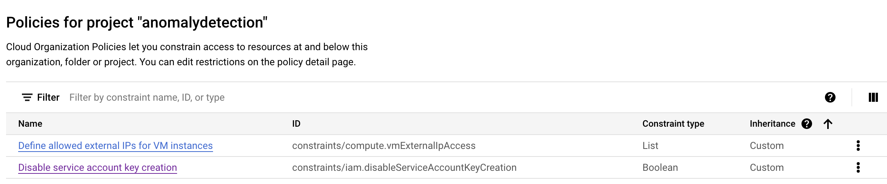

# About

This module includes all prerequisites for this Lab<br>

[0. Prerequisites](01-prerequisites.md#1-prerequisites)<br>
[1. Variables](01-prerequisites.md#1-varibles)<br>
[2. Enable APIs](01-prerequisites.md#2-enable-google-apis)<br>
[3. Create a VPC & a subnet](01-prerequisites.md#3-create-a-vpc--a-subnet)<br>
[4. Create firewall rules](01-prerequisites.md#4-create-firewall-rules)<br>
[5. Update organizational policies](01-prerequisites.md#5-implement-organizational-policies)<br>
[6. Service Account](01-prerequisites.md#6-create-a-user-managed-service-account)<br>
[7. Grant general IAM permissions](01-prerequisites.md#7-grant-general-iam-permissions)<br>
[8. Launch Apache Beam Notebook Instance](01-prerequisites.md#8-launch-notebook)<br>

## 0. Prerequisites

#### 1. Create a project called "anomaly-detection".<br>
Note the project number and project ID.
We will need this for the rest fo the lab.

Set the project back to "anomaly-detection" in the UI

## 1. Variables 

We will use these throughout the lab. <br>
Run the below in cloud shells coped to the new project you created-
```
DEST_PROJECT=`gcloud config get-value project`
VPC=$DEST_PROJECT"-vpc"
SUBNET=$VPC"-subnet"
REGION=us-central1
VPC_FQN=projects/$DEST_PROJECT/global/networks/$VPC

SERVICE_ACCOUNT="example-name" <Insert your service account id>
SERVICE_ACCOUNT_FQN=$SERVICE_ACCOUNT@$DEST_PROJECT.iam.gserviceaccount.com
YOUR_IP=xx.xxx.xx.xx <Make sure to get your machine IP and update here>

```
## 2. Enable API Services 

From cloud shell, run the below-
```
ggcloud services enable compute.googleapis.com
gcloud services enable aiplatform.googleapis.com
gcloud services enable dataflow.googleapis.com
gcloud services enable datastream.googleapis.com
gcloud services enable datacatalog.googleapis.com
gcloud services enable bigquery.googleapis.com
gcloud services enable composer.googleapis.com
gcloud services enable sourcerepo.googleapis.com
gcloud services enable cloudresourcemanager.googleapis.com
```

## 3. Create VPC & Subnet

Run the below from a cloud shell. 

```
gcloud compute networks create $VPC \
    --subnet-mode=custom \
    --bgp-routing-mode=regional \
    --mtu=1500
```

```
gcloud compute networks subnets create $SUBNET \
     --network=$VPC \
     --range=10.0.0.0/24 \
     --region=$REGION \
     --enable-private-ip-google-access
```
## 4. Create Firewall Rules 

4.1) Intra-VPC, allow all communication

```
gcloud compute firewall-rules create allow-all-intra-vpc --project=$DEST_PROJECT --network=$VPC_FQN \
    --description="Allows\ connection\ from\ any\ source\ to\ any\ instance\ on\ the\ network\ using\ custom\ protocols." --direction=INGRESS \
    --priority=65534 --source-ranges=10.0.0.0/20 --action=ALLOW --rules=all
```

4.2) Allow-SSH

```
gcloud compute firewall-rules create allow-all-ssh --project=$DEST_PROJECT --network=$VPC_FQN \
    --description="Allows\ TCP\ connections\ from\ any\ source\ to\ any\ instance\ on\ the\ network\ using\ port\ 22." --direction=INGRESS \
    --priority=65534 --source-ranges=0.0.0.0/0 --action=ALLOW --rules=tcp:22
```

4.3) Allow Ingress 

```
gcloud compute --project=$DEST_PROJECT firewall-rules create allow-all-to-my-machine --direction=INGRESS --priority=1000 --network=$VPC \
    --action=ALLOW --rules=all --source-ranges=$YOUR_IP

```
4.4) Allow your computer to access node-red from the browser on port 1880.

```
gcloud compute firewall-rules create allow-node-red 
--project=$DEST_PROJECT
--network=$VPC_FQN --description=Allows\ TCP\ connections\ from\ node\ red\ source\ to\ any\ instance\ on\ the\ network\ using\ port\ 1880. 
--direction=INGRESS 
--priority=1010 
--source-ranges=$YOUR_IP * You need this to open node-red from a browser on your computer
--action=ALLOW 
--rules=tcp:1880

```

## 5. Update Organizational Policies

In the Google Cloud Console, navigate to IAM -> Organization Policies

Turn off the following org policy - constraints/compute.vmExternalIpAccess, constraints/iam.disableServiceAccountKeyCreation



## 6. Service Account

Run the following in the cloud shell

```
gcloud iam service-accounts create ${SERVICE_ACCOUNT} \
    --description="User Managed Service Account" \
    --display-name=$SERVICE_ACCOUNT
```

## 7. Grant Permissions for Service Account that you just created

Run the following to grant all the permissions the service account needs to run this lab 

```
gcloud projects add-iam-policy-binding ${DEST_PROJECT} \
    --member=serviceAccount:${SERVICE_ACCOUNT_FQN} \
    --role=roles/iam.serviceAccountTokenCreator  
```
```
gcloud projects add-iam-policy-binding ${DEST_PROJECT} \
    --member=serviceAccount:${SERVICE_ACCOUNT_FQN} \
    --role=roles/pubsub.editor 
```
```
gcloud projects add-iam-policy-binding ${DEST_PROJECT} \
    --member=serviceAccount:${SERVICE_ACCOUNT_FQN} \
    --role=roles/pubsub.publisher
```
```
gcloud projects add-iam-policy-binding ${DEST_PROJECT} \
    --member=serviceAccount:${SERVICE_ACCOUNT_FQN} \
    --role=roles/bigquery.admin
```
```
gcloud projects add-iam-policy-binding ${DEST_PROJECT} \
    --member=serviceAccount:${SERVICE_ACCOUNT_FQN} \
    --role=roles/bigquery.dataEditor
```
```
gcloud projects add-iam-policy-binding ${DEST_PROJECT} \
    --member=serviceAccount:${SERVICE_ACCOUNT_FQN} \
    --role=roles/dataflow.developer
```
```
gcloud projects add-iam-policy-binding ${DEST_PROJECT} \
    --member=serviceAccount:${SERVICE_ACCOUNT_FQN} \
    --role=roles/dataflow.worker
```
## 8. Launch an Apache Beam notebook instance

Go to the Google Cloud Console->Dataflow Workflow->Workbench

Make sure that you are on the User-managed notebooks tab.

In the toolbar, click add New notebook.

Select Apache Beam > Without GPUs.

On the New notebook page, select the subnetwork you created in Step 3 for the notebook VM.

Click Create.

When the link becomes active, click Open JupyterLab. Vertex AI Workbench creates a new Apache Beam notebook instance.

## 9. Next Step

[Data Generation](02-Dataflow_Pub_Sub_Notebook.md) <BR>