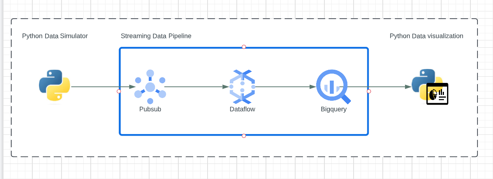
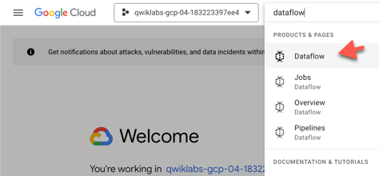
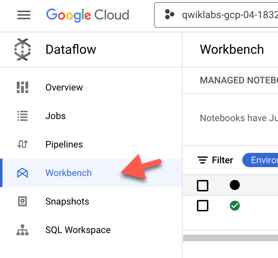
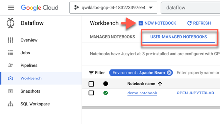
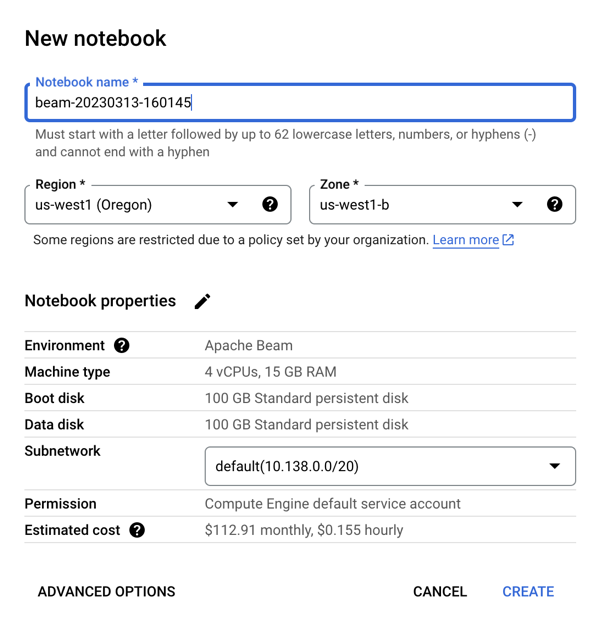
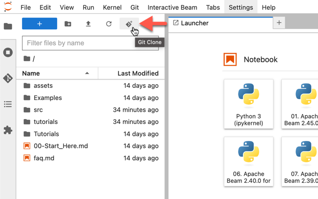
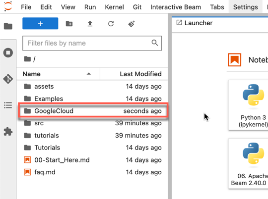

# Real Time Visibility: Anomaly Detection

### Overview

Anomaly Detection is a demo to show an end to end architecture of a streaming pipeline from raw data ingestion to transform the data using Dataflow - leveraging Dataflow notebooks, setting up an Apache Beam pipeline, transforming the data using Windows and finally landing the data in BigQuery for further analysis. 

### Architecture


### Getting Started

Within the GCP Console, type in `dataflow` at the top of the search bar 







You will see an existing Notebook called **demo-notebook**. This is a default notbook that has some examples in it. We will leave the default notebook alone and create a new notebook.

Click on** the User-Managed Notebooks** Tab and click **New Notebook**



Select Apache Beam > Without GPUs

Leave the default settings as is and click **CREATE**



You can click *Refresh* to see the notebook being provisioned.

Vertex AI Workbench will create a new Apache Beam notebook instance. Once it's available, click on **OPEN JUYPTERLAB**

Once the Notebook is launched, you will see some default files and folders that come pre installed when you launch a new Notebook

Next, we will clone a repo in order to get the files we need. Click on the **clone repo** icon:



Enter the below HTTPS address to clone the repo. This is a public repo containing the files we will use.

```shell
https://github.com/seidou-1/GoogleCloud.git
```

You can leave `Include submodules` **checked** and `Download the repository` **unchecked**


Once it's cloned, you'll see a folder called **GoogleCloud**




Click into that folder and continue until you reach the sub directory `anomalydetection-interactivenotebook-main `

Double click on the file `Dataflow_Pub_Sub_Notebook .ipynb` and follow the instructions in the Notebook.

