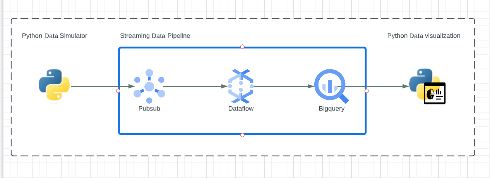

Copyright 2023 Google LLC

Licensed under the Apache License, Version 2.0 (the "License");
you may not use this file except in compliance with the License.
You may obtain a copy of the License at

    https://www.apache.org/licenses/LICENSE-2.0

Unless required by applicable law or agreed to in writing, software
distributed under the License is distributed on an "AS IS" BASIS,
WITHOUT WARRANTIES OR CONDITIONS OF ANY KIND, either express or implied.
See the License for the specific language governing permissions and
limitations under the License.

# Real Time Visibility - Anomaly Detection

Demo Asset for Anomaly Detection Use case RealTime Intelligence Go To Market Sales Play 

## About this Lab

Anomaly Detection is a demo to show an end to end architecture of a streaming pipeline from raw data ingestion to transform the data using Dataflow - leveraging Dataflow notebooks, setting up an Apache Beam pipeline, transforming the data using Windows and finally landing the data in BigQuery for further analysis. Below you will find an architecture diagram of the overall end to end solution

## Architecture 

## Lab Modules 

This repo is organized across various modules:

[1. Prerequisites - provisioning, configuring, securing](01-Prerequisites.md)  
<!-- [2. Data Generation](02-PythonSimulationScript.md)   -->
[2. Data Integration Pipeline](02-Dataflow_Pub_Sub_Notebook.md)  
