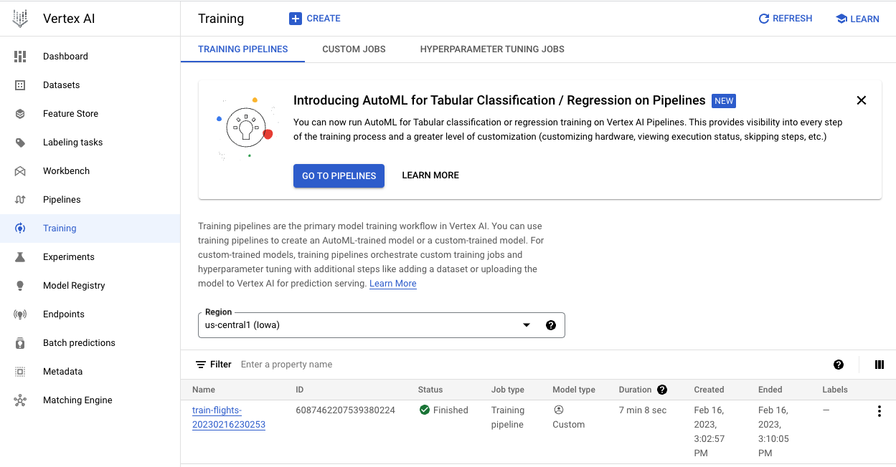

Copyright 2024 Google LLC

Licensed under the Apache License, Version 2.0 (the "License");
you may not use this file except in compliance with the License.
You may obtain a copy of the License at

    https://www.apache.org/licenses/LICENSE-2.0

Unless required by applicable law or agreed to in writing, software
distributed under the License is distributed on an "AS IS" BASIS,
WITHOUT WARRANTIES OR CONDITIONS OF ANY KIND, either express or implied.
See the License for the specific language governing permissions and
limitations under the License.

## Realtime Prediction
This lab helps you to implement a real-time, streaming, machine learning (ML) prediction pipeline that uses Dataflow, Pub/Sub, Vertex AI, BigQuery and Cloud Storage.

## Solution Overview
This lab predicts if a flight would arrive on-time using historical data from the US Bureau of Transport Statistics(BTS) website. (https://www.bts.gov/topics/airline-time-tables)
This website provides historical on-time performance information of domestic flights in the United States. All major US air carriers are required to file statistics about each of their domestic flights with the BTS. The data they are required to file includes the scheduled departure and arrival times as well as the actual departure and arrival times. From the scheduled and actual arrival times, the arrival delay associated with each flight can be calculated. Therefore, this dataset can give us the true value for building a model to predict arrival delay.

## Architecture

1. Data Ingestion 

    - Ingest - Extract Flight On-Time Perfomance Data (Date, Flight Number, Origin, Destination, Departure Time, Taxi Time, Arrival Time, etc  ) -> Stored in Cloud Storage Bucket
    
    - Ingest - Extract Airport Information (Airport code, City, Latitude, Longitiude, etc.,) -> Stored in Cloud Storage Bucket
    
    - Store  - Store standardized and transformed datasets in BigQuery

2. Model Training 

    - Batch Dataflow Process to create Training Dataset using simulated events. 

    - Use the Training Dataset for Vertex AI Model Training.

3. Prediction

    - Simulate - Simulate Realtime Fight Takeoffs & Landings and capture this data in Pub/Sub Topics.

    - Prediction - Streaming Dataflow job to read from Pub/Sub and call Vertex AI Model to predict on-time arrival of flights.
    
    - Store - Capture the predictions in a BigQuery Dataset for Analysis and Dashboarding needs.

## Datasets

1. Inputs

    - Airports Information        - airports 

    - Ontime Flight Data          - flights_raw

    - Time Zone Corrected Data    - flights_tzcorr     

    - Simulated Flight Event      - flights_simevents

2. Outputs

    - Streaming Prediction        - streaming_preds   

## Getting started

### Step 01. Create a GCP project and open Cloud Shell 

### Step 02. Clone this github repository: 

        git clone https://github.com/google/real-time-intelligence-workshop.git

### Step 03. Change Directory to **RealTimePrediction/realtime-intelligence-main**

        cd real-time-intelligence-workshop/RealTimePrediction/realtime-intelligence-main/

### Step 04. Execute script 
        
        ./setup_env.sh

This script sets up your project:

  - Create Project Variables

  - Enable necessary APIs

  - Add the necessary roles for the default compute service account

  - Create Network, Sub-network & Firewall rules

### Step 05. Execute script 

        ./stage_data.sh

This script will stage the following data for the lab

 - Download flight ontime performance data

 - Download flight timezone corrected data

 - Download Airport information

 - Download Flight Simulated Events

 - Upload the downloaded files to BigQuery 

### Step 06. Validate if data has been copied to Cloud Storage and BigQuery
        
Sample image of the GCS Bucket

- In Google Cloud Console menu, Navigate to Cloud Storage and validate if <PROJECT_ID>-ml bucket is created

Open the bucket and validate if the following files exists

 - flight_simevents_dump*.gz(5 files)

 - flight folder has 3 sub-folders    - airports, raw & tzcorr

 - airports folder has 1 file         - airports.csv

 - raw folder has 2 files             - 201501.csv & 201502.csv

 - tzcorr folder has 1 file           - all_flights*

Sample Image of Bigquery Dataset        

     

- In Google Cloud Console menu, Navigate to BigQuery and validate if flights dataset is created

Open the dataset and validate if the following tables exists

 - airports          - 13,386 rows

 - flights_raw       - 899,159 rows

 - flights_simevents - 2,600,380 rows

 - flights_tzcorr    - 65,099 rows

### Step 07. Check Organization Policies to review the following constraints 

 - In Google Cloud Console menu, navigate to IAM->Organization Policies

 - Turn off Shielded VM Policy 

 - Filter the following constraint to validate current settings

        constraints/compute.requireShieldedVm

Sample Image of Shielded VM - Organization Policy

 

 - Allow VM external IP Access 

 - Filter the following constraint to validate current settings

        constraints/compute.vmExternalIpAccess 

Sample Image of External IP Access - Organization Policy

 

### Step 08. Execute script  to install the necessary packages.

        ./install_packages.sh

 - These packages are necessary to run tensorflow and apache beam processes

### Step 09. Execute script create_train_data.sh to create data for model training.

 This script creates data for testing, training and validation of the model.

  - In the Google Cloud Console menu, navigate to Dataflow > Jobs

  - Click on traindata job to review the job graph

  - Wait for the job to run and succeed - will take about 20 minutes

Sample Image of Dataflow Jobs - Note: traindata is a batch job

 

Sample Image of TrainData Job Graph

 

Open <PROJECT_ID>-ml bucket to validate the following files and folders are present

 - train folder with 1 sub-folder  - data with 4 files - all*.csv, test*.csv, train*.csv, validate*.csv

Sample Image of the bucket

 

 - flights folder with 2 sub-folders - staging & temp, that have staging and temp files

Sample Image of the bucket

 

### Step 10. Execute script to train and deploy the model 

        ./train_model.sh

 - In Google Cloud Console menu, navigate to Vertex AI -> Training to monitor the training pipeline.

Sample Image of Vertex AI Training Pipeline

 

 - When the status is Finished, click on the training pipeline name and select Deploy & Test tab 

Sample Image of Vertex AI Deployment 

 

 - Monitor the deployment status of the model
 
 - Note: It will take around 20 minutes to complete the model training and deployment.

 - Once the model is deployed the flights endpoint will be used to call the model for prediction.

Sample Image of Vertex AI Endpoint 

 

### Step 11. Open another tab in cloud shell and execute script to stream simulated flight data

        ./simulate_flight.sh

 - In Google Cloud Console menu, navigate to Pub/Sub -> Topics 

 -  Review 3 topics that were created to stream simulated flights events 

   - arrived     - simulates flight arrivals
   - departed    - simulates flight departures
   - wheels-off  - simulates flight take-offs

Sample Image of Pub/Sub Topics 

 

### Step 12. In the previous tab execute script to predict the probaility of flights being on time 

        ./predict_flights.sh

This scripts will create a streaming data flow job that calls the AI model trained in Step 10

Sample Image of Dataflow Jobs - Note: predictions is a streaming job

        

Sample Image of predictions Job Graph

 

 - Wait for 15 minutes. 

 - In Google Cloud Consule menu,  navigate to BigQuery -> SQL Studio

 - Open the dataset flights and review streaming_preds table 

 - Streaming predictions on probalblity of flight ontime arrival is captured in this table  

Sample Image of Streaming Predictions Table

 

